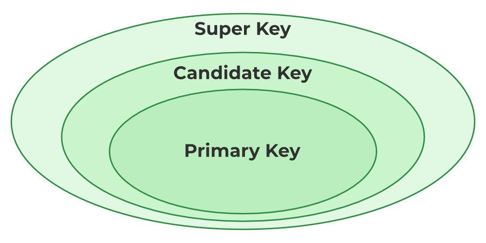
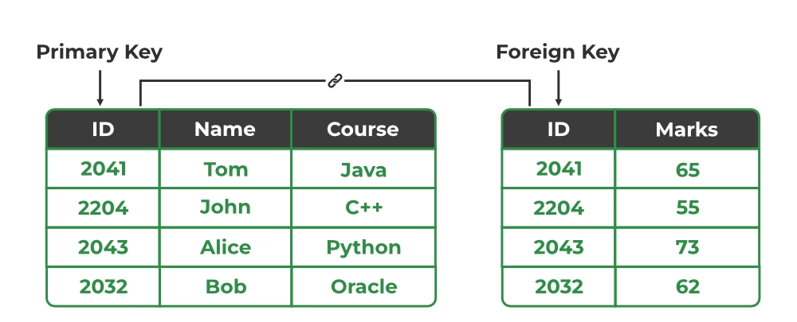
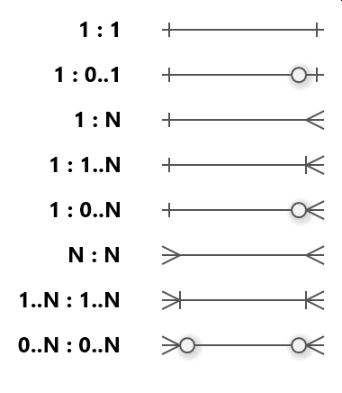
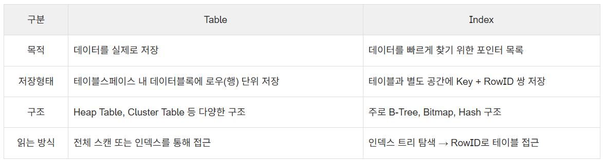

- PK, FK란?

    
    Super Key(슈퍼키) : 튜플(레코드, 행)을 유일하게 식별할 수 있는 속성(1개 이상) 집합 
    
    Candidate Key(후보키) : 튜플을 유일하게 식별할 수 있는 최소한의 속성 집합
    
    **Primary Key(기본키, PK)** : 테이블의 튜플을 유일하게 식별하기 위해 후보키 집합에서 선택된 키
    
    - 중복 값, NULL 값 허용 X
    - 단일 속성 가능, 여러 속성의 조합도 가능(⇒ Composite Key, 복합키)
    - DB의 더 빠른 접근과 검색을 가능하게 함
    
    Alternate Key(대체키) : 기본키로 선택되지 않은 후보키
    

    
    **Foreign Key(외래키)** : 다른 테이블의 기본키를 참조하는 속성 
    
    - 테이블 간의 관계를 설정
    - 데이터의 무결성 유지, 데이터 중복 방지
    - 중복 값 가능, NULL값 가능(이지만 일반적으로 NOT NULL)
    
    참고 자료 
    
    https://www.geeksforgeeks.org/dbms/types-of-keys-in-relational-model-candidate-super-primary-alternate-and-foreign/

- ERD란?

    **ERD(Entity Relationship Diagram)**
    
    데이터베이스의 개체들 사이 관계를 시각적으로 표현한 것, DB 설계 과정에서 사용하는 모델링 기법
    
    구성요소
    
    - Entity(개체)
    관리하고자 하는 정보의 실체
        
        사람, 역할, 이벤트, 개념, 객체와 같이 정의할 수 있는 것 (명사)
        
        개체 유형 : 명사의 범주 (ex : 음식, 스포츠, 국가)
        
        인스턴스 : 개체 유형 내의 개별 개체 (ex : 채소의 인스턴스는 브로콜리, 당근, etc)
        
    - Attribute(속성)
        
        개체 또는 개체 유형을 정의하는 자질, 특성
        
        -단순 속성  : 더 이상 단순화 되거나 추가 속성으로 분리될 수 없는 속성(ex : 우편번호)
        
        -복합 속성 : 두 개 이상의 속성으로 분리할 수 있는 속성(ex : 주소 → 도로 번호 + 도로명  + …)
        
        -파생 속성 : 다른 속성으로부터 유도(계산)되는 속성 (ex : 총 급여 → 근무 시간, 급여 기간, …)
        
        -다중값 속성 : 하나의 인스턴스(레코드)가 한 속성에 대해 2개 이상의 값을 가질 수 있는 속성                                  (ex : 취미, 상품 목록, etc) 
        
    
    - Relation(관계)
        
        ERD의 개체를 연결하는 연결선, ERD 내의 개체가 서로 연관되는 방식을 나타냄
        
    
    참고자료
    
    https://www.ibm.com/kr-ko/think/topics/entity-relationship-diagram
    
    https://help.lucid.co/hc/ko/articles/16471565238292-Lucidchart%EC%97%90%EC%84%9C-%EC%97%94%ED%84%B0%ED%8B%B0-%EA%B4%80%EA%B3%84-%EB%8B%A4%EC%9D%B4%EC%96%B4%EA%B7%B8%EB%9E%A8-%EB%A7%8C%EB%93%A4%EA%B8%B0#entity-relationship-diagram-overview
    
    https://nbcamp.spartaclub.kr/blog/erd-%EA%B0%9C%EC%B2%B4-%EA%B4%80%EA%B3%84-%EC%9D%B4%ED%95%B4%EB%A5%BC-%EB%8F%95%EB%8A%94-%ED%8C%81-19137

- 연관관계란? 그리고 연관관계를 설정하는 방법은?

    **연관 관계** : 개체 간의 논리적 연결
    
    관계 유형(Cardinality)
    
    - 일 대 일 (one to one)
        
        1 대 1 로 매칭되는 관계 (ex : 1대학 ↔ 1총장)
        
    - 일 대 다 (one to many)
        
        1 대 다수로 매칭되는 관계 (ex : 1대학 ↔ N학과)
        
    - 다 대 다 (many to many)
        
        다수와 다수가 매칭되는 관계 (ex : N교수 ↔ M학생)
        
    
    **설정 방법**
    
    1. 개체 도출 및 속성 정의
        
        저장할 개체 정의, 각 개체(테이블)의 기본키, 일반 속성 설정
        
    2. 관계 유형 식별
    3. 관계 방향 설정 및 외래키 부여
        
        1:N 관계에서 N 쪽에 1의 기본키를 외래키로 추가
        
        N:M 관계는 둘 사이의 관계 속성을 가지는 테이블을 만들어 두 개의 1:N 관계로 변환
        
    4. 식별/비식별 관계 설정
        
        식별 관계 : 부모 테이블의 기본키가 자식 테이블의 기본키의 일부가 될 때
        
        비식별 관계 : 부모 테이블의 기본키가 자식 테이블의 일반 속성(외래키)가 될 때
        
    

    
    crow’ foot notation을 이용하여 관계 유형 표현
    
    참고자료
    
    https://velog.io/@jin5eok5/DB-%EC%97%B0%EA%B4%80%EA%B4%80%EA%B3%84%EC%99%80-ERD
    
    https://www.ibm.com/kr-ko/think/topics/entity-relationship-diagram

- 정규화란?

  **정규화** : DB 설계에서 데이터를 효율적으로 구성하기 위해 사용하는 프로세스

  이점

    - 데이터 중복 감소

      데이터를 한 곳에만 저장하여 공간 절약, 효율성 개선

    - 데이터 이상치 제거

      삽입, 삭제, 업데이트 이상(Anomaly) 방지

        - 삽입 이상 : 데이터를 삽입할 때 의도하지 않은 데이터까지 삽입해야만 하는 현상
        - 삭제 이상 : 데이터를 삭제할 때 의도하지 않은 데이터까지 삭제되는 현상
        - 업데이트 이상 : 중복 데이터 중 일부만 수정되어 모순이 일어나는 현상
    - 데이터 무결성 개선

      데이터가 정확하고, 한 곳에만 저장되도록 보장하여 데이터의 정확성, 일관성 유지

    정규형 : 정규화를 위한 일련의 규범적 규칙, 데이터 중복 및 이상에 대한 솔루션
    
    - 제 1 정규형 (1NF) : 구조적 기반
        
        규칙 : 모든 열에는 고유한 이름이 있어야 하며 모든 셀에는 분할할 수 없는 단일 값만 포함되어야 한다.
        
        해결하는 문제 : 항목 목록을 단일 셀에 넣을 수 없다. 각 목록은 자체 행을 가지며, 이를 통해 데이터를 검색하고 관리할 수 있다.
        
    - 제 2 정규형(2NF) : 부분 종속 항목 제거
        
        규칙 : 테이블은 이미 1NF에 있어야 하며, 모든 키가 아닌 열은 일부가 아닌 전체 복합키에 의존해야 한다.
        
        해결하는 문제 : 데이터는 완전히 속한 위치에만 저장해야 한다.                                                            ex) 키가 (OrderID, ProductID)인 테이블에서,  속성 ‘제품 가격’은 ProductID에만 종속 → 테이블에 포함 X  ⇒ ProductID와 제품 가격을 별도의 테이블로 이동
        
    - 제 3 정규형(3NF) : 임시 종속 항목 제거
        
        규칙 : 테이블은 2NF에 있어야 하며, 키가 아닌 열은 기본키에만 종속되어야 한다.
        
        해결하는 문제 : 키가 아닌 하나의 데이터가 다른 키가 아닌 데이터의 값을 결정하는 것을 방지
        
    
    참고자료
    
    https://cloud.google.com/discover/what-is-database-normalization?hl=ko 

- 반 정규화란?

  **반 정규화** : DB의 성능 향상을 위해 데이터 중복을 허용하고 조인을 줄이는 기법

  조회 속도 ⬆️, 데이터 모델 유연성⬇️

  반 정규화를 수행하는 경우

    - 정규화에 충실했을 때 종속성, 활용성은 향상되지만 수행 속도가 느려지는 경우
    - 다량의 범위를 자주 처리해야 하는 경우
    - 특정 범위의 데이터만 자주 처리해야 하는 경우
    - 요약/집계 정보가 자주 요구되는 경우

  반 정규화 절차

    1. 대상 조사 및 검토

       데이터 처리 범위, 통계성 등 확인 ⇒ 반 정규화 대상 조사

    2. 다른 방법 유도 검토

       반 정규화 수행 전 다른 방법 검토 (ex : 클러스터링, 뷰, 인덱스 튜닝)

    3. 반 정규화 적용

  반 정규화 기법

    - 계산된 컬럼 추가

      필요해 보이는 계산된 컬럼을 추가

    - 테이블 수직 분할

      컬럼을 분할해 하나의 테이블을 두 개 이상의 테이블로 분할

    - 테이블 수평 분할

      하나의 테이블에 있는 값을 기준으로 테이블을 분할

    - 테이블 병합
        - 1:1 관계의 테이블을 하나로 병합
        - 1:N 관계의 테이블을 하나로 병합(많은 양의 데이터 중복 발생)
        - 슈퍼 타입과 서브 타입 관계가 발생하면 테이블을 병합
            - EX

              슈퍼 타입 - 고객                                                                                                                     서브 타입 - 개인 고객 / 법인 고객   ⇒ 부모 자식 관계

    - 파티션 기법

      파티션을 사용하여 테이블을 분할 → 논리적으로는 하나의 테이블, but 여러 개의 데이터 파일에 나누어 저장

      ⇒ 데이터 조회 시 엑세스 범위⬇️, I/O 성능 향상, 각 파티션 독립적 백업 및 복구 가능

    참고자료
    
    https://ossam5.tistory.com/668
    
    https://velog.io/@dddooo9/%EB%8D%B0%EC%9D%B4%ED%84%B0%EB%B2%A0%EC%9D%B4%EC%8A%A4-%EB%B0%98%EC%A0%95%EA%B7%9C%ED%99%94
    
    https://haburu23.tistory.com/15

- DB에서의 상속 관계 표현은 어떻게 하는가?

  RDB 에는 상속 관계가 없음

  슈퍼 타입 - 서브 타입 관계가 객체 상속과 유사

  **구현 전략**

    - 조인 전략

      각 개체를 별도의 테이블로 변환 후, 조인을 통해 전체 데이터를 구성

      특징

        - 각 개체가 테이블로 분리되어 관리
        - Super class는 추상 클래스로 구현하는 것이 권장
        - 정규화된 테이블 구조

      장점

        - 정규화 된 테이블, 외래키 참조 무결성 제약조건 활용 가능
        - 설계가 깔끔하고, 저장 공간 효율⬆️

      단점

        - 조회 시 다수의 조인 필요 → 성능 저하 발생 가능
        - 조회 쿼리가 복잡해지고, 데이터 저장 시 INSERT가 2번 호출

    - 단일 테이블 전략

      모든 개체를 하나의 통합 테이블로 구성하는 방식 → JPA 기본 전략

      특징

        - Super class는 추상 클래스로 구현하는 것이 권장

      장점

        - 조인이 필요 X → 성능⬆️, 쿼리 단순화

      단점

        - 자식 개체에 매핑된 컬럼은 NULL 허용
        - 테이블 크기가 증가 → 조회 성능 저하

    - 구현 클래스마다 테이블 전략

      각 서브 타입을 별도의 테이블로 변환하는 방식

      특징 및 장점

        - 서브 타입을 명확히 구분해 처리 가능
        - NOT NULL 제약조건 적용 가능

      단점

        - 여러 자식 테이블 조회 시 UNION → 성능⬇️
        - 자식 테이블을 통합하기 어려움, 권장X

      참고자료

      https://go-gradually.tistory.com/m/entry/%EC%83%81%EC%86%8D-%EA%B4%80%EA%B3%84-%EB%A7%A4%ED%95%91

      https://keeeeeepgoing.tistory.com/m/293

- 인덱스란?

  **인덱스(Index)** : DB 테이블에서 데이터를 빠르게 조회할 수 있도록 도와주는 자료구조

  특정 컬럼의 데이터를 별도의 공간에 물리적 주소와 함께 저장 → B-Tree구조가 일반적

  

  장점

    - 검색 성능 향상

      선형 탐색(O(N)) 대신 로그(O(log N)) 탐색 또는 해시 기반 탐색(O(1)) 가능

    - 정렬/그룹핑 최적화

      ORDER BY 없이도 정렬된 결과 반환 가능

    단점
    
    - 쓰기 성능 저하
        
        INSERT, UPDATE, DELETE 시 인덱스 갱신 → 오버헤드 발생
        
    - 저장 공간 증가
        
        테이블과 별개의 저장 공간 차지
        
    
    참고 자료
    
    https://murphytklee.tistory.com/31#heading-1
    
    https://velog.io/@bagt/DB-Index%EC%97%90-%EB%8C%80%ED%95%98%EC%97%AC