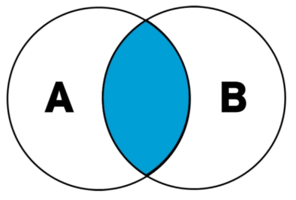
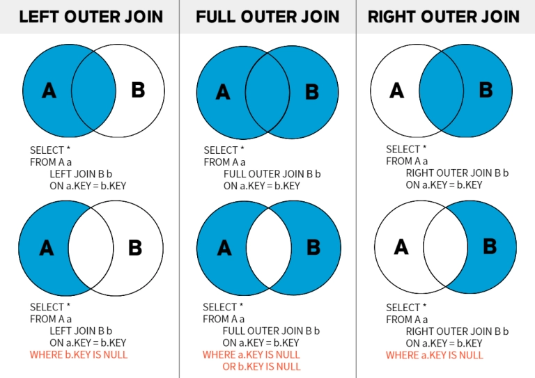

- DB Join이란?

  **Join** :  두 개 이상의 테이블을 엮어 하나의 결과 테이블로 만드는 것

  하나의 테이블 만으로는 원하는 결과를 얻을 수 없는 경우, 두 개 이상의 테이블을 묶어서 원하는 결과를 얻기 위해 사용

- Join 종류들

  **INNER JOIN** : ****기준 테이블과 JOIN 테이블의 교집합
  JOIN 조건에 맞는 행을 출력

  

  SELECT * FROM TableA A
  INNER JOIN TableB B
  ON A.key = B.key
    
  ---

  **OUTER JOIN** : 기준 테이블의 행은 조건에 맞지 않아도 출력

  LEFT, FULL, RIGHT OUTER JOIN이 있다.

  

  위 사진처럼 같은 OUTER JOIN이더라도 WHERE 절의 조건에 따라 집합의 형태가 달라진다.

  FULL OUTER JOIN은 성능/요구⬇️ 등의 문제로 거의 사용X → MySQL 도 지원 X
  RIGHT OUTER JOIN도 테이블 순서만 바꾸면 LEFT OUTER JOIN과 결과가 동일 → 사용⬇️
    
  ---

  **CROSS JOIN** : 한 쪽 테이블의 모든 행과 다른 쪽 테이블의 모든 행을 조합
  ⇒ Catesian Product, 경우의 수를 생성할 때 가장 많이 사용
    
  ---

  **SELF JOIN** :  같은 테이블을 자기 자신과 JOIN

  정해진 문법 없이, 같은 테이블을 조인하여 사용
  같은 테이블 안에 있는 행과 행의 관계를 표현하기 위해 사용
  (ex : 직원과 상사, 같은 점수의 학생, 더 비싼 상품 등)

  참고자료

  https://adjh54.tistory.com/155

  https://innovation123.tistory.com/211

  https://hongong.hanbit.co.kr/sql-%EA%B8%B0%EB%B3%B8-%EB%AC%B8%EB%B2%95-joininner-outer-cross-self-join/

  https://yuna-story.tistory.com/164

- 트랜잭션이란?

  **트랜잭션** : DB의 상태를 변화시키는 하나의 논리적 작업 단위
  하나의 외부 거래를 기록하기 위해 시스템 내부에서 완료되어야 하는 일련의 처리 동작

  **ACID 원칙**

  **A**tomicity(원자성)
  트랜잭션 내의 작업은 모두 반영되거나, 모두 취소되어야 함(롤백)

  **C**onsistency(일관성, 정합성)
  트랜잭션 완료 후 DB는 일관된 상태를 유지해야 함

  **I**solation(고립성, 격리성, 독립성)
  각 트랜잭션은 서로 간섭 없이 독립적으로 수행되어야 함

  **D**urability(지속성, 내구성)
  성공한 트랜잭션은 영구적으로 반영되어야 함

  *A계좌 출금과 B계좌 입금이 대표적인 예시

  참고자료
  https://learn.microsoft.com/ko-kr/windows/win32/ktm/what-is-a-transaction

  https://terms.tta.or.kr/dictionary/dictionaryView.do?word_seq=058427-1

- Join on 과 where의 차이점

  ON : JOIN 시 두 테이블의 행을 결합하는 기준 → 행을 **붙일지 말지** 결정
  특히 OUTER JOIN에서는 매칭 여부만 판단, 매칭X 인 기준 테이블의 행은 NULL과 함께 유지

  WHERE : JOIN이 수행된 이후 결과를 필터링하는 조건 → 붙은 결과를 **남길지 말지** 결정
  OUTER JOIN에 사용시 NULL이 포함된 행이 제거되어 결과가 INNER JOIN 처럼 변할 수 있음

  INNER JOIN에서는 ON과 WHERE 모두 결과를 제한하는 역할이므로 대부분 동일한 결과가 나옴