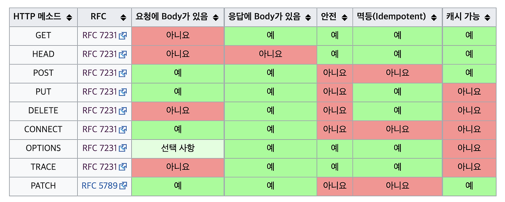
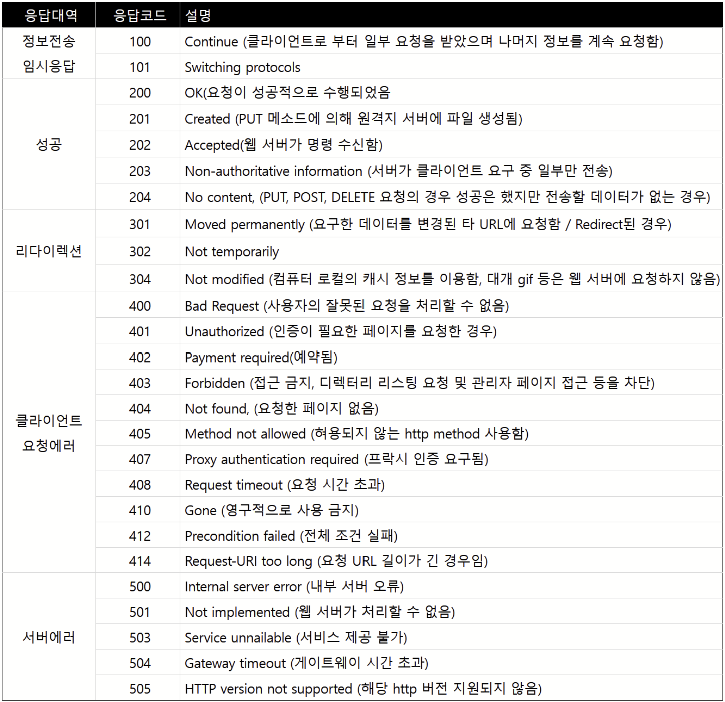

- RESTful API란?

  **REST (REpresentational State Transfer)**

  API 작동 방식에 대한 조건을 부과하는 소프트웨어 아키텍처
  -아키텍처 : 구조+ 설계 방식 + 규칙 + 철학

  단어별로 뜯어보면
  -Representation : 표현, 표현 형태
  → 자원을 JSON 같은 형태로 표현
  -State : 상태
  → 서버 자원의 상태
  -Transfer : 전달 / 전송
  → 서버-클라이언트 사이의 전송
  ⇒ 자원의 상태를 표현 형태로 주고받으며 서버와 클라이언트가 상호작용하는 웹 아키텍처 스타일

  **REST 설계 원칙**

    - 균일한 인터페이스

      모든 리소스를 동일한 방식으로 식별하고 조작하도록 하는 원칙

        - 리소스 식별
          모든 리소스는 URI로 식별해야 한다.
          -URI는 행동이 아닌 대상(Resource)을 표현해야 함
          -클라이언트는 URI를 통해 원하는 리소스를 요청
        - 표현을 통한 리소스 조작
          클라이언트는 리소스의 표현(JSON 등)을 통해 리소스를 수정하거나삭제할 수 있다.
          -서버는 리소스 상태를 표현으로 전달
          -클라이언트는 그 표현을 이용해 작업 수행
        - 자기 설명적 메세지
          요청과 응답 메세지만 보고도 어떻게 처리해야 하는지 이해할 수 있어야 한다.
          -데이터 형식, 가능한 행동, 상태 코드 등의 메타데이터를 포함
        - HATEOAS(Hypermedai As The Engine of Application State)
          클라이언트는 서버가 보내주는 링크를 따라 다음 행동을 결정해야 한다.
        - 서버가 다음 행동 경로를 하이퍼링크로 알려줌
        - 자기 설명적 메세지의 일부라고 하기도 함
    - 클라이언트-서버 분리

      클라이언트와 서버는 서로 완전히 독립적이어야 한다. 클라이언트는 오직 요청된 리소스의 URI만 알아야 한다.

      클라이언트와 서버의 인터페이스가 변경되지 않는 한, 둘은 독립적으로 개발되거나 대체될 수 있어야 한다.

    - 무상태

      서버는 클라이언트의 이전 요청 상태를 저장하지 않고, 각 요청은 독립적으로 처리되어야 한다.(서버 측 세션이 필요 X)

      클라이언트는 각 요청마다 필요한 정보를 모두 포함해서 보내야 한다.

    - 캐시 가능성

      서버의 응답은 캐시될 수 있도록 표시되어야 하며, 클라이언트는 캐시된 응답을 재사용할 수 있어야 한다.

      서버는 응답을 보낼 때 캐시가 가능한지, 가능하다면 얼마나 유지할 지를 응답 헤더에 포함해서 보냄

      클라이언트는 같은 요청이 있을 때 저장된 응답을 사용 가능

      ⇒ 서버 부하 감소, 응답 속도 증가, 네트워크 트래픽 감소

    - 계층화된 시스템 아키텍쳐

      클라이언트는 자신이 직접 서버와 통신하는지, 중간 계층을 거치는지 알 필요 없이 요청을 처리할 수 있어야 한다.

      REST는 시스템을 여러 계층으로 나눌 수 있지만, 어떤 계층을 거치든 요청은 동일한 방식으로 처리됨

    - 코드 온디맨드(선택 사항)

      서버는 필요할 경우 클라이언트에게 실행 가능한 코드를 전달하여 클라이언트의 기능을 확장할 수 있다.

      기능을 동적으로 추가 가능

      ex) HTML의 body 안의 JavaScript

    **RESTful API**
    REST 스타일을 따르는 웹 API → REST 원칙을 지키며 설계된 API
    
    이점
    
    - 확장성
        
        REST가 클라이언트-서버 상호작용을 최적화 → 효율적인 크기 조정 가능
        
        무상태 → 서버 로드 제거
        
        잘 관리된 캐싱 → 일부 클라이언트-서버 상호작용을 제거
        
        ⇒ 통신 병목현상을 일으키지 않으면서 확장성 지원
        
    - 유연성
        
        완전한 클라이언트-서버 분리 → 각 부분이 독립적으로 발전 가능
        
        +계층화된 구조는 유연성을 더 향상
        ex) 클라이언트 로직을 다시 작성하지 않아도 DB 계층 변경 가능 
        
    - 독립성
        
        사용되는 기술에 독립적 → API 설계에 영향을 주지 않고 다른 언어로 작성 가능, 통신에 영향을 주지 않고 기본 기술 변경 가능
        
    
    **RESTful API 작동 방식**
    
    1. 클라이언트의 HTTP 요청
        
        원하는 작업에 따라 적절한 HTTP 메서드를 선택해 서버에 요청
        
        이 때 요청에는 주소(URL) + 서버가 요청을 이해하고 처리하기 위한 여러 정보가 포함됨
        
    2. 서버가 리소스에 대한 작업을 수행
        
        클라이언트의 요청을 보고 대상 리소스 확인, HTTP 메서드로 수행할 동작 해석 → 필요한 작업 수행
        
    3. 서버가 리소스 상태를 표현 형태로 만들어 응답
        
        리소스의 현재상태를 표현으로 만듬(JSON 등) → 처리 결과를 HTTP 응답으로 클라이언트에게 전송(상태 코드, 헤더, 바디)
        
    4. 클라이언트의 응답 해석, 다음 동작
        
        서버의 응답을 받아 요청 성공 여부 확인 → 응답 데이터 해석 → 화면 표시 or 다음 동작 수행  
        
    
       
    
    https://aws.amazon.com/ko/what-is/restful-api/
    
    https://www.ibm.com/kr-ko/think/topics/rest-apis
    
    https://m.blog.naver.com/codingbarbie/223233477242
    
    https://prohannah.tistory.com/156

- 멱등성이란?

  **멱등성**

  동일한 요청을 한 번 보내는 것과 여러 번 연속으로 보내는 것이 같은 효과를 지니고, 서버의 상태도 동일하게 남는 속성

  → 몇 번 수행하든 결과가 같음

  **멱등성이 필요한 이유**

    1. 데이터 일관성 유지

       중복 요청 처리 - 네트워크 지연, 서버 장애, 타임 아웃 등으로 인한 동일한 요청에 대해 데이터의 일관성을 유지할 수 있게 함

       무결성 보호 - 동일한 작업을 반복해도 데이터 상태가 변하지 않도록하여 시스템 무결성 보호
       ex) 동일한 결제 요청이 중복 처리 되면 사용자 계좌에서 금액이 여러번  차감 → 이런 문제를 방지함

    2. 안전한 재시도 및 실패 처리

       재시도 전략 구현 - 작업 실패 시 재시도가 필요 → 멱등성이 보장되면 항상 안전하게 재시도 가능

       오류 회복 용이성 - 작업이 중간에 실패시 복구가 용이함
       ex) 클라이언트 요청-DB작업-응답 의 과정에서
       DB 작업 이후에 응답 전에 오류 → 클라이언트는 성공 여부를 알 수 없어 같은 요청을 재전송 → 중복 결제, 중복 데이터 생성 등을 막음

    3. 캐싱 및 성능 최적화

       캐시 활용 - 작업의 결과가 항상 동일 → 캐싱으로 성능 최적화 가능, 서버 및 네트워크 부하 감소

    4. 안정적이고 직관적인 API 설계

       클라이언트 신뢰성 향상 - 클라이언트 개발자가 안전하게 API 사용 가능 → 신뢰성⬆️

       명확하고 예측 가능한 동작 - 여러 요청에도 결과가 변하지 않음 → API 사용법이 직관적, 예측 가능

    5. 분산 시스템의 신뢰성 확보

       복제된 서비스와의 일관성 유지 - 분산 시스템에서 여러 서비스/DB가 복제되어 운용되는 경우 → 어느 노드에서 요청을 처리하더라도 동일한 결과 보장

       복잡한 상태 전환 관리 용이 - 분산 시스템에서는 상태가 여러 위치에서 변경 가능 → 상태 전환에 멱등성을 적용하면 시스템 전반에서 일관된 최종 상태 유지 가능

    **HTTP 메서드 멱등성 예시**
    
    - GET
        
        리소스를 조회 ->아무리 반복해도 가져오는 데이터가 변하지 않음 → 멱등성을 가짐
        
    - PUT
        
        리소스 전체를 업데이트 → 리소르를 계속 덮어쓰므로 동일한 요청이 여러번 들어가도 최종 상태는 한 번 요청했을 때와 동일함 → 멱등성을 가짐
        
    - DELETE
        
        리소스를 삭제 → 이미 삭제된 리소스를 다시 삭제하려 해도 오류는 발생할 수 있지만, 최종 상태는 변하지 않음 → 멱등성을 가짐
        
    - POST
        
        새로운 리소스를 생성 → 동일한 POST 요청을 반복하면 같은 내용의 새 리소스가 계속해서 추가 → 멱등성이 없음
        
    
    **멱등성 구현 방법**
    
    - 고유 식별자 ≈  멱등성 토큰 ≈ 멱등 키
        
        요청별 고유 ID 부여 - 각 요청에 고유한 ID를 부여하여 중복 요청을 구분 / 동일한 ID를 가진 요청이 여러 번 전달될 경우 중복 요청으로 판단 → 2번째 요청부터 무시
        
        ⇒ 로직이 실행되기 전에 중복 요청 방지
        
    - 낙관적 동시성 제어
        
        동시 작업 충돌 방지 : 여러 사용자가 동시에 데이터를 수정할 때 발생하는 충돌 방지 기법
        
        자원의 상태가 갱신될 때마다 특정 번호나 타임 스탬프를 할당, 클라이언트가 자원을 업데이트할 때 현재 버전 번호와 일치하는지 확인하고, 충돌 시 업데이트 차단 및 재시도 요청 
        
        ex) 버전 관리
        
        자원의 버전 관리 - 자원의 상태를 버전으로 관리하여 특정 버전의 자원이 업데이트될 때 다른 버전에 영향을 주지 않도록 설계 → 자원이 업데이트될 때 새로운 버전을 생성하여 여러 요청이 동일한 자원을 업데이트해도 최신 버전 유지 가능
        
        ⇒ 같은 요청이 여러 번 와도 결과는 한 번만 반영
        
        첫 번째 요청 성공 → 두 번째 요청 → version mismatch → 실패
        
        상태는 더 이상 변하지 않아 멱등성을 가짐
        
        ⇒로직 실행 후 저장할 때 충돌 방지
        
    - DB 제약 조건 및 트랜잭션 활용
        
        중복 방지 제약 조건 설정 - DB에서 특정 컬럼에 고유 제약 조건을 설정하여 중복된 데이터 입력을 방지, 트랜잭션을 활용하여 일괄 작업이 성공적으로 완료되었을 경우만 커밋되도록 설정
        
        ⇒ DB 상태 보호, 요청 중복 제어X
        
    
    https://docs.tosspayments.com/blog/what-is-idempotency
    
    https://developer.mozilla.org/ko/docs/Glossary/Idempotent
    
    https://f-lab.kr/insight/understanding-idempotency-and-its-applications
    
    https://tech.pxd.co.kr/post/%EB%A9%B1%EB%93%B1%EC%84%B1-257

- HTTP 메서드 종류

  **HTTP 메서드**

  HTTP 요청에서 서버의 특정 리소스에 대해 어떤 작업을 수행할지 나타내는 방법

  HTTP 요청 구성 요소

    - HTTP 메서드(요청 메서드)
      → 어떤 행동을 할지
    - URI(URL)
      → 어떤 리소스를 요청할지
    - HTTP 버전
      → ex) HTTP/1.1 , 브라우저가 자동으로 붙여서 전송, 개발자가 관리X
    - 요청 헤더
      → 부가정보 전달(인증, 캐시 등)
    - 요청 바디
      → 서버에 전달할 데이터

  **HTTP 메서드 종류**

    - GET
        - 리소스 조회 메서드
        - 서버에 데이터를 전달하는 경우 쿼리스트링으로 전달
          → 전달하는 데이터가 노출, 브라우저 히스토리에도 기록이 남음
        - 요청 바디로 데이터 전달이 가능하긴 하지만 서버에서 따로 구성이 필요 → 권장X
        - 정적, 동적, HTML Form 데이터 조회
    - POST
        - 전달한 데이터 처리/생성 메서드 → 주로 생성
        - 요청 바디로 서버에 데이터를 전달하면 서버는 데이터를 처리하여 업데이트
        - Content-Type헤더를 사용해 바디의 데이터 형식을 명시(ex: JSON)
        - JSON으로 조회 데이터를 넘겨야하는 등의 경우엔 POST로 조회도 가능
    - PUT
        - 리소스 대체 메서드(덮어쓰기) → 부분 수정이 불가능
        - 리소스가 존재하면 대체, 없으면 생성
        - 클라이언트가 리소스의 정확한 위치(URI)를 식별하고 지정함
        - 요청 바디로 데이터 전달, Content-Type 명시
    - PATCH
        - 리소스 부분 수정 메서드
        - 요청 바디로 수정하려는 데이터만 전달
        - PATCH를 지원하지 않는 경우 POST로 대체
          → URI나 API 규칙을 수정용으로 따로 설계하는 경우가 많음
    - DELETE
        - 리소스 삭제 메서드
        - 요청 바디가 필요 없음 → URI로 리소스 식별
    - HEAD
        - 리소스 조회 메서드
        - GET과 동일한 응답을 요구하지만, 응답 본문(바디)가 없음
          → 응답의 상태 코드, 리소스의 수정 여부(헤더) 등을 확인(일종의 검사 역할)
    - OPTIONS
        - 리소스 또는 서버가 지원하는 HTTP 메서드나 통신 옵션 조회 메서드
        - URI로 리소스를 식별해서 요청을 보내면 해당 리소스에 대해 어떤 HTTP 메서드를 사용 가능한지 응답
        - OPTIONS * 로 서버 전체로도 보낼 수 있음(거의 사용 X)
    - CONNECT
        - 클라이언트가 프록시 서버에게 목적지 서버까지 TCP 터널 연결을 요청하는 메서드
        - 클라이언트 -HTTP→ 프록시 -HTTP→ 목적지 서버 의 구조에서
          클라이언트 -TCP→ 프록시 -TCP→ 목적지 서버 의 구조로 바뀜
          HTTP 메서드 해석X, URL 확인 X, 요청 수정 X, 그저 통로 역할
        - 웹 API 개발자가 직접 구현 X (네트워크/보안 개념)
    - TRACE
        - 디버깅용 메서드
        - 네트워크 경로를 거쳐 서버에 어떤 형태로 요청이 도달했는지 확인하기 위해 사용
        - 서버는 요청 메세지를 그대로 응답으로 반환(바디에 담아)
        - 요청 바디가 없는 것이 일반적
        - 쿠키, 인증 헤더, 토큰 등이 응답 바디에 노출 가능 → 보안문제로 사용⬇️

  **HTTP 메서드 속성**

    - 안전성(Safe)

      호출해도 리소스를 변경하지 않는다.

    - 멱등성(Idempotent)

      한 번의 호출과 여러 번의 호출 결과가 같다.

    - 캐시가능성(Cacheable)

      응답 결과를 캐시에 저장해서 동일한 요청에 재사용이 가능하다.

    
    참고 - HTTP 응답 코드
    

    
    https://inpa.tistory.com/entry/WEB-%F0%9F%8C%90-HTTP-%EB%A9%94%EC%84%9C%EB%93%9C-%EC%A2%85%EB%A5%98-%ED%86%B5%EC%8B%A0-%EA%B3%BC%EC%A0%95-%F0%9F%92%AF-%EC%B4%9D%EC%A0%95%EB%A6%AC
    https://hstory0208.tistory.com/entry/HTTP-%EB%A9%94%EC%84%9C%EB%93%9C-%EC%A2%85%EB%A5%98-%EB%B0%8F-%EC%86%8D%EC%84%B1
    https://bruders.tistory.com/143
    https://twojun-space.tistory.com/155#google_vignette