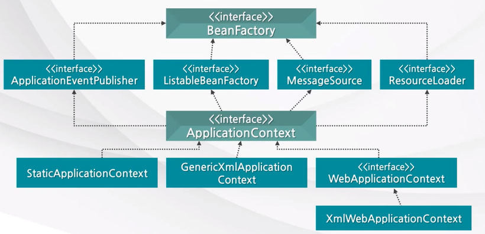
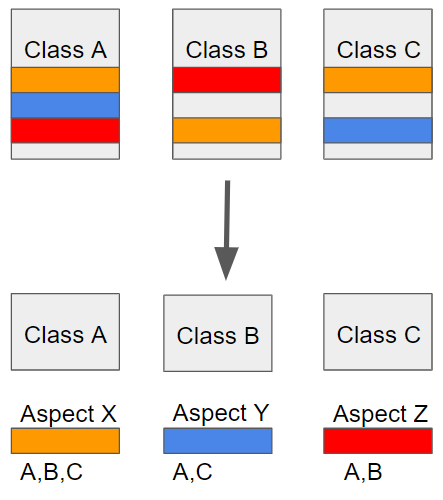
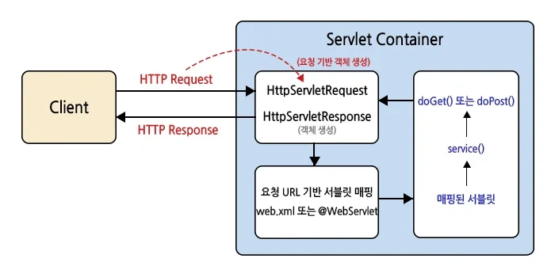

- **SOLID원칙이란?**

  **SOLID 원칙**

  객체 지향 프로그래밍에서 지켜야 할 5가지 원칙 for 유지 보수, 확장성 ,유연성⬆️

    - **Single Responsibility (단일 책임 원칙) ⇒ SRP**

      “하나의 클래스는 하나의 기능/역할을 담당하여 하나의 책임을 수행하는데 집중되어야 한다.”
      책임 → 기능/역할 담당

      하나의 클래스에 여러 역할이 있다면, 역할을 변경/수정할 경우 연쇄작용으로 수정해야 할 부분이 많아짐 → 이를 해결하기 위한 원칙 ⇒ 유지 보수⬆️

      ex) 학사 관리 → 수강 관리 + 성적 관리

    - **Open-Closed (개방-폐쇄 원칙) ⇒ OCP**

      “확장에는 열려있어야 하며 수정에는 닫혀있어야 한다.”

      기능을 추가하는 경우 클래스 확장을 통해 쉽게 구현하면서, 확장에 따른 클래스 수정은 최소화하는 설계 기법 → 추상 클래스와 상속으로 구현 ⇒ 다형성, 확장성⬆️

    - **Liskov Substitution (리스코프 치환 원칙) ⇒ LSP**

      “상위 클래스 객체는 언제나 자신의 하위 클래스 객체로 대체될 수 있어야 한다.”

      상위 클래스의 객체가 들어갈 자리에 하위 클래스의 객체를 넣어도 문제 없이 잘 작동해햐 함
      → 업캐스팅 된 상태에서 상위 클래스의 메서드를 사용해도 동작이 의도대로 흘러가야 함

      상속과 오버라이딩의 중요성을 강조, 오버라이딩시 피터코드의 상속 규칙을 준수

        1. is-a 관계 유지
        2. 하위 클래스는 상위 클래스의 기존 기능을 수정하면 안 됨
        3. 상위 클래스에서 하위 클래스로 대체가 가능해야 함
        4. 상속은 재사용이 아닌 확장을 위해 사용

    - **Interface Segregation (인터페이스 분리 원칙) ⇒ ISP**

      “클라이언트는 자신이 사용하지 않는 메서드와 의존 관계를 맺으면 안 된다.”

      다수의 클래스가 하나의 일반적인 인터페이스를 사용하는 것보다 하나의 클래스가 여러 개의 구체적인 인터페이스를 사용하도록 해야 함

      클라이언트를 기준으로 필요한 기능/메서드 군이 존재하면 분리
      ⇒ 내부 의존성(결합도)⬇️

    - **Dependency Inversion (의존 역전 원칙) ⇒ DIP**

      “고수준 모듈은 저수준 모듈에 의존하면 안 되며, 두 모듈 모두 추상화(인터페이스)에 의존해야 한다.”

      구현 클래스가 아닌 추상 클래스(인터페이스)에 의존해야 함

      의존 관계를 맺는 경우, 변하기 쉬운(자주 변하는) 하위 클래스보다 변화가 어려운(거의 없는) 상위 클래스(인터페이스)와 의존 관계를 맺어야 한다는 의미

- **DI란?**

  **의존성(Dependency) :** 어떤 객체가 기능을 수행하기 위해 다른 객체를 필요로 하는 관계

    - 강한 결합(Tight Coupling)

      객체가 다른 객체를 직접 생성하고 의존하여 변경 시 다른 객체까지 변경해야 하는 상태

      일반적으로 new 연산자를 사용하여 구체 클래스를 직접 참조

      ⇒ 코드 수정이 어렵고, 테스트가 어려움 → 유지 보수⬇️

    - 느슨한 결합(Loose Coupling)

      객체 간의 의존성을 줄여, 한 객체의 변경이 다른 객체에 최소한의 영향만 미치는 상태

      구체 클래스 대신 추상 클래스/인터페이스에 의존 또는 외부에서 객체를 주입받아(DI) 사용

      ⇒ 유연성, 확장성⬆️ → 유지 보수⬆️


    **DI(의존성 주입, Dependency Injection) :** 객체가 의존하는 또 다른 객체를 외부에서 생성하고 주입하는 것
    
    - 결합도 감소 → 수정의 전이⬇️ ⇒ 유지 보수성 향상
    - 테스트 용이성 → 다른 객체와 독립적으로 테스트 능
    - 유연성, 확장성 향상 → 객체가 독립적이므로 다른 객체에서도 재사용 가능
    
    다만 모든 객체에 적용할 필요X, 메서드 내부에서 일시적으로 사용하는 객체/Java 표준 라이브러리 객체 등 의존성 관리가 필요없는 경우 new로 직접 생성하는 것이 적절함  
    
    https://velog.io/@wlsdks12/Spring-%EA%B0%9D%EC%B2%B4-%EC%A3%BC%EC%9E%85-%EC%A7%81%EC%A0%91%EC%83%9D%EC%84%B1new-vs-DI%EC%BB%A8%ED%85%8C%EC%9D%B4%EB%84%88
    
    https://velog.io/@mayhan/%EC%9D%98%EC%A1%B4%EC%84%B1Dependency%EA%B3%BC-%EC%9D%98%EC%A1%B4%EC%84%B1-%EC%A3%BC%EC%9E%85DI

- **IoC란?**

  **IoC(제어의 역전, Inversion of Control) :** 코드의 제어 흐름과 객체 관리를 외부(ex: 프레임워크)로 넘기는 설계 패턴

  객체 생성, 생명 주기 관리, 의존성 관리의 제어권이 개발자에서 프레임워크/컨테이너로 이동
  → 보통 프레임워크/컨테이너가 DI를 대신 수행하며 IoC 구현

  **기존 방식 vs IoC**

    - 객체 생성 주체 및 의존 관계 설정
        - 기존 : 개발자가 직접 생성(new) 및 연결
        - IoC : 컨테이너가 생성, 의존성 주입 및 관리
    - 제어 흐름
        - 기존 : 개발자가 전체 흐름 제어
        - IoC : 프레임워크/컨테이너가 흐름 제어
    - 코드 결합도
        - 기존 : 강한 결합 → 의존 객체 변경 시 코드 수정 필요
        - IoC : 느슨한 결합 → 의존 객체 변경 시 설정 변경으로 해결 가능
    - 테스트 용이성
        - 기존 : mock 객체를 넣기 어려움
        - IoC : 의존성 교체가 쉬워 테스트가 용이

  **IoC 컨테이너 :** 위에서 말한 제어권을 수행하는 도구, 작성한 코드를 스스로 참조하여 객체의 생성, 생명주기 관리, 의존성 주입을 함

  **Spring 에서의 IoC 컨테이너**

    - BeanFactory

      객체(Bean) 생성 및 관리, 간단한 DI 기능 제공 → 최소 기능 컨테이너

    - ApplicationContext

      BeanFactory의 기능 + 이벤트 처리, 메세지 처리 등의 추가 기능 → 확장 컨테이너


    ⇒ 특별한 이유가 없다면 ApplicationContext 사용을 권장
    

    
    **고려 사항**
    
    - 복잡도 증가
        
        제어 흐름을 컨테이너가 담당하면서 눈에 보이지 않게 됨 → 설정, 컨테이너에 대한 이해가 필요함(진입 장벽) 
        
    - 디버깅의 어려움
        
        객체의 생성 지점을 파악하기 어려움, 프록시 객체 개입 등
        
    - 설정 의존성 증가
    
    https://dev-coco.tistory.com/80
    
    https://lucas-owner.tistory.com/39#google_vignette
    
    https://okeybox.tistory.com/436

- **생성자 주입 vs 수정자, 필드 주입 차이는?**

  DI의 3가지 방법

    - **생성자 주입**

        ```java
        @Service
        public class UserService{
        
        	private final UserRepository userRepository;
        	
        	//생성자 주입
        	@Autowired //생성자가 하나인 경우 생략 가능
        	public UserService(UserRepository userRepository){
        		this.userRepository = userRepository;
        	}
        }
        ```

      생성자를 통해 의존성 주입

      final 키워드를 사용 → 객체 생성 시 1번만 할당, 불변성 보장

      의존성을 명시 → 명확하게 드러남

      객체 생성 시 할당되어 Null Pointer Exception 발생 X

      ⇒ 안정성, 명확성⬆️, 불변성

    - **수정자 주입**

        ```java
        @Service
        public class UserService{
        
        	private UserRepository userRepository;
        	
        	//수정자(Setter) 주입
        	@AutoWired
        	public void setUserRepository(UserRepository userRepository){
        		this.userRepository = userRepository;
        	}	
        }
        ```

      @AutoWired 어노테이션을 사용해 Setter 메서드를 통해 의존성 주입(유연성⬆️)

      객체 생성 이후 Setter 메서드 호출 시 의존성 주입 → final 키워드 사용 불가 → 불변성 보장 X

      선택적인 의존성 주입 시 적합하나, 의존성이 변경 가능 → 객체 상태의 일관성이 깨질 수 있음

      Null Pointer Exception 발생 가능

      ⇒ 간결 but 유지보수⬇️, 불변성X

    - **필드주입**

        ```java
        @Service
        public class UserService{
        	
        	//필드 주입
        	@AutoWired
        	private UserRepository userRepository;
        }
        ```

      @AutoWired 어노테이션을 사용해 객체 내 필드에서 의존성 주입

      객체 생성 이후 의존성 주입 → final 사용 불가 → 불변성 보장 X

      의존성이 외부에 드러나지 않음 → 코드의 명확성⬇️

      ⇒ 유연성⬆️, 안정성⬇️, 불변성X


    ⇒ 일반적으로 생성자 주입을 권장
    
    **불변성 :** 객체의 상태가 생성 이후 변경되지 않는 것
    
    의존성은 객체의 구성 요소(행동 방식 그 자체) → 한 번 정해지면 바꾸지 않는 것이 원칙
    
    실행 중 변경 시 동작의 일관성이 깨지고, 디버깅이 어려워짐
    
    https://backendcode.tistory.com/249#google_vignette
    
    https://wildeveloperetrain.tistory.com/139#google_vignette

- **AOP란?**

  **Aspect Oriented Programming(관점 지향 프로그래밍)**

  핵심 비즈니스 로직과 공통적인 부가 기능을 분리하여 모듈화 하는 프로그래밍 기법



  Cross-cutting Concerns(공통 관심사) : 소스코드 상에서 다른 부분에 계속해서 쓰이는 코드

  → 흩어져있는 공통 관심사를 모듈화, 비즈니스 로직에서 분리 및 재사용

  **핵심 개념**

    - Aspect : 부가 기능 모듈(Advice + PointCut)
    - Target : 부가 기능을 부여할 대상
    - Advice : 실질적으로 수행할 부가 기능 로직
        - @Before

          Advice Target 메서드가 호출되기 전에 Advice 기능 수행

        - @After

          Target 메서드가 완료되면 Advice 기능 수행(성공, 예외 등 결과와 관계X)

        - @AfterReturning

          Target 메서드가 결과값 반환 후에 Advice 기능 수행

        - @AfterThrowing

          Target 메서드가 예외를 던지면 Advice 기능 수행

        - @Around

          Target 메서드 실행 전/후로 Advice 기능 수행

          인자로 ProceedingJointPoint를 받아 proceed 메서드 실행이 필수

            ```java
            @Around("execution(* com.example..*(..))")
            public Object around(ProceedingJoinPoint joinPoint) throws Throwable {
            
                System.out.println("Before");
            
                Object result = joinPoint.proceed();  //여기서 Target 메서드 실행됨
            
                System.out.println("After");
            
                return result;
            }
            ```

    - Joint Point : Advice가 적용될 위치
    - Pointcut : Advice를 적용할 Joint Point를 선정하는 방법
    - Weaving : 기존 코드에 Aspect를 적용해 실행 흐름에 넣는 과정
    - Proxy : Target 객체를 대신하여 호출을 가로채는 대리 객체

      Target이 아닌 Proxy를 통해 메서드 호출, Proxy는 Target 메서드 실행 전후에 부가 기능(전/후처리)을 수행 가능

      Client → Proxy → Target (Client는 Proxy를 인지 X)


    **AOP 동작 방식**
    
    - 컨테이너 초기화
        
        Spring Container가 빈(Targer 객체 생성) → AnnotationAwareAspectJAutoProxyCreator 라는 빈 후처리기가 개입, 다음 작업을 실행
        
        - 생성된 빈이 Pointcut 조건에 부합하는지 검사
        - 조건에 해당하면 프록시 객체 생성
            
            -프록시 생성 방식
            
            - JDK Dynamic Proxy
                
                Target이 인터페이스일 때 사용
                
                인터페이스를 구현한 프록시 생성
                
            - CGLIB Proxy
                
                Target이 클래스일 때 사용
                
                Target 클래스를 상속하여 프록시 생성
                
            
            → 상황에 따라 자동 선택
            
        - 기존 Target 객체 대신 프록시 객체를 빈으로 등록
        
        → 실제 컨테이너에 등록된 빈은 타겟이 아닌 프록시 객체
        
    - 런타임 호출
        1. 클라이언트 → 프록시 메서드 호출
        2. 프록시가 Pointcut 조건 검사, 부합하면 Advice 실행
        3. Advice는 타겟을 감싸는 형태로 동작, 내부에서 타겟 메서드 실행
        4. 실행 결과는 Advice를 거쳐 최종 결과를 클라이언트에게 반환  
        
        Client → Proxy → Advice → Target → Advice → Client
        
    
    https://mingstory-tech.tistory.com/47
    
    https://coding-factory.tistory.com/1169
    
    https://engkimbs.tistory.com/entry/%EC%8A%A4%ED%94%84%EB%A7%81AOP
    
    https://www.egovframe.go.kr/wiki/doku.php?id=egovframework:rte4.3:fdl:aop

- **서블릿이란?**

  **서블릿(Servlet) :** 자바 기반의 웹 애플리케이션을 개발하기 위한 서버 측 프로그램 또는 기술
  동적 웹 페이지를 만들 때 사용되는 자바 기반의  웹 애플리케이션 프로그래밍 기술

  클라이언트의 HTTP 요청을 받아 비즈니스 로직을 수행하고 처리 결과를 응답으로 만들어 반환
  → 이 과정에서 DB 조회, 데이터 가공 등의 작업이 이루어짐

  **주요 특징**

    - HTTP 프로토콜 서비스 지원(HttpServlet을 상속)
    - JAVA의 Thread를 이용하여 동작 → 플랫폼에 독립적
    - HTML을 이용하여 응답
    - 클라이언트의 요청에 대해 동적으로 작동하는 WAS 컴포넌트
    - TCP 기반의 HTTP → UDP보다 느린 속도
    - 웹 서버/애플리케이션에서 실행, 클라이언트의 요청에 따라 동적으로 콘텐츠 생성
    - 웹 애플리케이션의 기능 확장, 새로운 기능 추가에 사용가능

  **생명주기**

    - init()

      서블릿이 처음 생성될 때 1번만 호출, 초기화 작업 수행

    - service()

      클라이언트의 각 요청마다 호출, 실제 로직 처리

    - destroy()

      서버 종료 시 호출, 자원 해제 및 종료 작업 수행


    **서블릿 컨테이너**
    
    서블릿 객체의 생명 주기를 관리, 클라이언트의 요청을 받고 응답하도록 웹 서버와의 소켓 통신을 지원 (ex : Apache Tomcat, Jetty, etc)
    
    아래의 역할 수행
    
    1. 웹 서버와의 통신 지원
        
        웹 서버 → 서블릿 컨테이너 → 서블릿 → 서블릿 컨테이너 → 웹서버
        의 과정으로 HTTP 요청, 응답이 전달
        
    2. 서블릿 생명 주기 관리
        
        서블릿 컨테이너가 시작되거나 서블릿이 호출되는 시점에 서블릿 클래스 로딩, 인스턴스화 후 초기화 실행
        
        이후 클라이언트의 각 요청에 대해 service() 메서드 호출, 컨테이너 종료 시점 혹은 서블릿이 불필요한시점에 destroy() 메서드 호출
        
        - 서블릿 객체는 싱글톤으로 관리 → 단일 인스턴스로 모든 요청 처리 → 메모리 사용 효율적, 초기화 비용 ⬇️
    3. 멀티스레드 지원 및 관리
        
        하나의 서블릿 객체를 여러 요청이 동시에 사용 → 내부적으로 스레드 풀(thread pool)을 유지하여 스레드 관리
        
        다수의 요청을 동시에 처리 가능, 스레드 재사용 → 시스템 자원을 효율적으로 관리 가능
        
        멀티스레드 환경으로 인한 문제 발생 가능(인스턴스 변수 등 공유 자원 사용 시) → 필요한 경우 동기화를 통한 스레드 안전성에 대한 보장이 필요
        
    4. 선언적 보안 관리
        
        web.xml 설정 파일 또는 어노테이션을 통해 웹 애플리케이션의 보안 관리 가능
        
        web.xml 사용 시 개발자는 코드 변경 없이 보안에 대한 제약, 인증, 권한 등을 수정 가능   
        
    
    **동작 과정**
    

    
    1. 웹 서버가 클라이언트로부터 요청을 받아 서블릿 컨테이너에 전달
    2. 서블릿 컨테이너는 HttpServletRequest, HttpServletResponse 객체를 생성
    →Request 객체는 받은 요청을 기반으로 생성
    3. 요청 URL을 기반으로 해당 요청을 처리할 서블릿 매핑 및 request, response 객체 전달
    4. 서블릿은 매핑된 요청을 처리(service() 메서드 호출), 결과를 response 객체에 저장
    5. HttpServletResponse 객체를 웹 서버를 통해 클라이언트에게 반환, 응답 종료
    6. 응답 종료 후 request, response 객체 소멸
    
    https://developshrimp.com/entry/JAVA-%EC%84%9C%EB%B8%94%EB%A6%BFServlet-%EC%99%84%EB%B2%BD-%EC%9D%B4%ED%95%B4%EB%A5%BC-%EC%9C%84%ED%95%9C-%EC%A0%95%EB%A6%AC 
    
    https://jh2021.tistory.com/20
    
    https://wildeveloperetrain.tistory.com/372