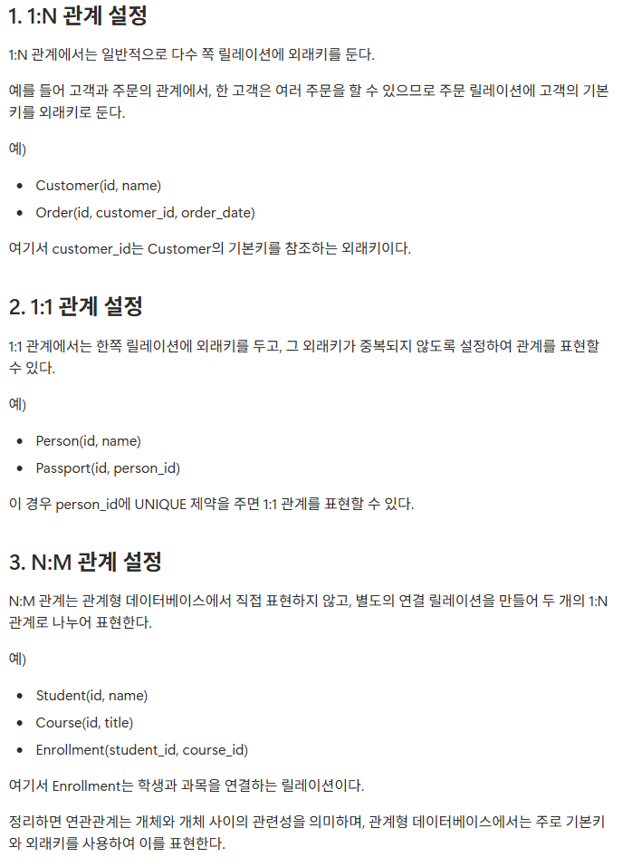
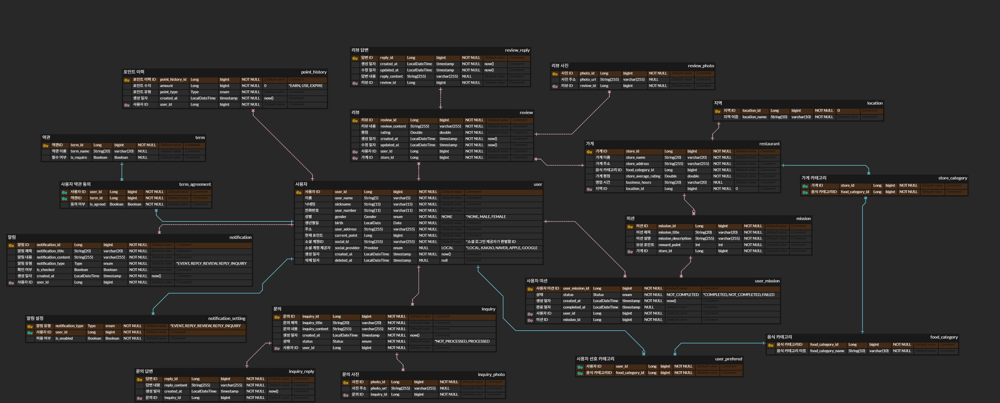

### 워크북 캡쳐

### 워크북 리뷰

🌟

DB의 연관관계를 설정하는 방법을 각 종류별로 예시를 들어 설명해두어서 직관적으로 이해할 수 있었다. 특히 외래키와 제약조건까지 짚어주어 테이블이 관계를 가지고 연결되는 원리를 구조적으로 이해하는데 도움이 되었다.

- **미션 기록**

  ERD 사진

  

  설명

 

  먼저, IA와 WF를 바탕으로 필요할 것 같은 기본 개체들을 선정했다.

    - 사용자
    - 약관
    - 음식 카테고리
    - 미션
    - 가게
    - 리뷰
    - 알림
    - 문의
    - 포인트 이력

  위의 기본 개체들을 바탕으로 WF를 살펴보면서 추가적인 저장이 필요해 보이는 보조 개체를 선정했다.

    - 리뷰 사진
    - 리뷰 답변
    - 문의 사진
    - 문의 답변
    - 알림 설정

  이후 각 개체들의 관계를 정의했다.

    - 사용자 : 약관 = N : M

      사용자는 여러 약관에 동의할 수 있고, 약관은 여러 사용자에게 동의 받을 수 있음

    - 사용자 : 음식 카테고리 = N : M

      사용자는 여러 음식 카테고리를 선호할 수 있고, 음식 카테고리는 여러 사용자에게 선호 받을 수 있음

    - 사용자 : 미션 = N : M

      사용자는 여러 미션을 받을 수 있고, 미션은 여러 사용자에게 주어질 수 있음

    - 가게 : 음식 카테고리  = N : M

      가게는 여러 음식 카테고리를 가질 수 있고, 음식 카테고리는 여러 가게를 나타낼 수 있음

    - 사용자 : 문의 = 1 : N

      사용자는 여러 문의를 보낼 수 있음

    - 문의 : 문의 사진 = 1 : N

      한 문의에 여러 개의 사진을 첨부 가능

    - 문의 : 문의 답변 = 1 : 1

      문의에 대한 답변은 한 번으로 가정

    - 사용자 : 알림 = 1 : N

      사용자는 여러 알림을 받을 수 있음

    - 사용자 : 알림 설정 = 1 : N

      사용자는 여러 알림 유형에 대해 수신 여부를 설정할 수 있음

    - 사용자 : 리뷰 = 1 : N

      사용자는 여러 리뷰를 남길 수 있음

    - 가게 : 리뷰 = 1 : N

      가게에는 여러 리뷰가 달릴 수 있음

    - 리뷰 : 리뷰 사진 = 1 : N

      리뷰에는 사진 여러 장이 첨부 가능

    - 리뷰 : 리뷰 답변 = 1 : 1

      리뷰에 대한 답변은 하나로 가정

    - 사용자 : 포인트 이력 = 1 : N

      사용자는 여러 번의 포인트 적립/사용/소멸 이력을 가질 수 있음

    - 가게 : 미션 = 1 : N

      가게는 여러 개의 미션을 가질 수 있음

     N:M 관계를 두 개의 1:N 관계로 표현하기 위해 관계 테이블을 추가했다.
    
    - 가게 카테고리
        
        가게와 음식 카테고리 사이의 N : M 관계를 표현
        
    - 사용자 선호 카테고리
        
        사용자와 음식 카테고리 사이의 N : M 관계를 표현
        
    - 사용자 미션
        
        사용자와 미션 사이의 N : M 관계를 표현
        
    - 사용자 약관 동의
        
        사용자와 약관 사이의 N : M 관계를 표현
        
    
    이렇게 총 18개의 테이블을 만들었고, 각 테이블에 필요한 속성들과 타입을 정의했다. 
    
    가게 카테고리 / 사용자 선호 카테고리 테이블의 경우엔 추가적인 속성이 필요 없다고 판단해서 각 피참조 테이블의 PK를 복합키로 사용하는 PK로만 설정했다.
    
    사용자 미션 / 사용자 약관 동의 테이블의 경우 위와는 다르게 추가적인 정보를 담아야 하기 때문에 관련 속성을 추가하고, 따로 ID 속성을 두어 PK로 지정했다.
    
    알림 설정 테이블의 경우 알림의 유형과 사용자 ID의 복합키를 PK로 지정했다. ID 속성을 추가하는 것 보다, 사용자 ID와 알림 유형의 조합을 PK로 사용하면 테이블의 크기도 줄어들고, 각 레코드를 유일하게 식별할 수 있다고 판단했기 때문이다.
    
    나머지 기본 및 보조 테이블은 WF의 각 해당하는 페이지에 나와있는 정보들을 담을 수 있는 속성들로 정의했다.
    
    *지역 테이블이 없었다. 1주차 미션을 보고 나서, 지역 선택 기능이 있는 것을 확인 했고, 지역 테이블을 추가했다. 지역은 가게와 1 : 1 관계로 설정했다.
    
