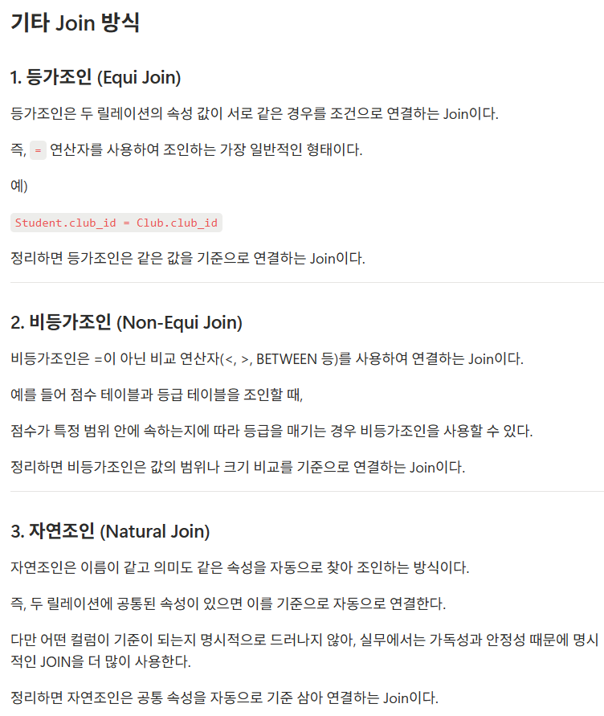

### 워크북 캡쳐

### 워크북 리뷰

<aside>
🌟

다른 챌린저들도 나도 위와 같은 기타 조인들에 대해서는 자세히 조사하지 않은 것 같다.  그린의 워크북 덕분에 조인의 개념에서 조건의 성격에 따라 어떻게 조인이 달라지는지 명확하게 짚고 넘어갈 수 있었다.

</aside>

======= 미션 ======= 

리뷰 작성하는 쿼리,
* 사진의 경우는 일단 배제

쿼리문

<aside>

사용자/가게의 ID를 1이라고 가정, 리뷰 id를 자동으로 1씩 증가하며 생성한다고 가정하면
review 테이블의 리뷰 내용, 평점, 사용자ID, 가게ID 속성을  지정한 값을 추가하는 쿼리가 필요하다.

INSERT INTO review (review_content, rating, user_id, store_id)
VALUES (”음 너무 맛있어요~~”, 5.0, 1, 1);

</aside>

마이 페이지 화면 쿼리

쿼리문

<aside>

사용자 테이블의 닉네임, 이메일, 휴대폰 번호, 현재 포인트 속성을 조회하는 쿼리가 필요하다.

SELECT nickname, user_email, user_number, current_point  
FROM user
WHERE user_id = 1;

</aside>

홈 화면 쿼리
(현재 선택 된 지역에서 도전이 가능한 미션 목록, 페이징 포함)

쿼리문

<aside>

달성한 미션의 수를 계산해서 표시

SELECT COUNT(*)
FROM user_mission
WHERE user_id = 1;

---

현재 선택된 지역에서 도전이 가능한 미션 목록, 페이징

현재 선택된 지역 ‘안암동’의 지역 ID를 1이라고 가정
지역 ID가 1인 가게 ID를 찾고, 그 ID로 미션을 찾는다. 미션들을 현재 날짜를 기준으로 시작시점과 종료시점 사이에 있는 미션/활성화 되어있는 미션을 필터링하고, 그 결과에서 가게 이름, 미션 내용, 보상 포인트, 남은 기한을 보여준다.

SELECT s.store_name, m.mission_description, m.reward_point, m.end_at
FROM store s
JOIN mission m ON m.store_id = s.store_id
WHERE s.location_id = 1
AND CURRENT_DATE BETWEEN m.start_at AND m.end_at
AND m.is_active = 1;

위 SQL로 홈 화면에 필요한 정보를 찾을 수 있으나, 아직 페이징이 포함되어있지 않다.
가게 이름, 미션 내용, 보상 포인트, 종료 기한 만으론 미션을 유일하게 식별하기 어려울 수가 있다고 판단했고, 추가로 미션 ID를 조회해서 커서로 활용하도록 한다.

SELECT m.mission_id, s.store_name, m.mission_description, m.reward_point, m.end_at
FROM store s
JOIN mission m ON m.store_id = s.store_id
WHERE s.location_id = 1
AND CURRENT_DATE BETWEEN m.start_at AND m.end_at
AND m.is_active = 1
AND m.mission_id > ? #cursor
ORDER BY m.mission_id ASC
LIMIT 10;

</aside>

내가 진행중, 진행 완료한 미션 모아서 보는 쿼리(페이징 포함)

쿼리문

<aside>

내가 진행중, 진행 완료한 미션을 모아서 보상 포인트, 가게 이름, 미션 내용, 성공 여부를 조회해야 한다.

나의 사용자 ID를 1이라고 가정
사용자 ID가 1이면서 상태가 완료 혹은 미완료인 사용자 미션을 찾는다. 찾은 미션의 내용, 보상포인트를 조회하고, ID로 해당 미션에 맞는 가게를 찾는다.

SELECT m.reward_point, m.mission_description, um.status, s.store_name
FROM user_mission um
JOIN mission m ON m.mission_id = um.mission_id
JOIN store s ON m.store_id = s.store_id
WHERE um.user_id = 1
AND um.status IN (’COMPLETED’, ‘NOT_COMPLETED’);

마찬가지로 페이징을 위해 미션 ID를 추가로 조회하여 커서로 활용한다. 또, 완료 상태별로 묶어서 보이도록 ORDER BY stauts를 추가한다.

SELECT m.mission_id, m.reward_point, m.mission_description, um.status, s.store_name
FROM user_mission um
JOIN mission m ON m.mission_id = um.mission_id
JOIN store s ON m.store_id = s.store_id
WHERE um.user_id = 1
AND um.status IN (’COMPLETED’, ‘NOT_COMPLETED’)
AND (
um.status > ?
OR (um.status = ? AND m.mission_id > ?)
) #복합 커서
ORDER BY um.status ASC, m.mission_id ASC
LIMIT 10;

#복합 커서 → 현재 커서의 status보다 뒤에 오는 status이거나, status가 같다면 mission_id가 더 큰 것
status와 mission_id를 함께 커서로 사용해서 완료 상태별로 묶어서 페이징하도록 했다.

</aside>