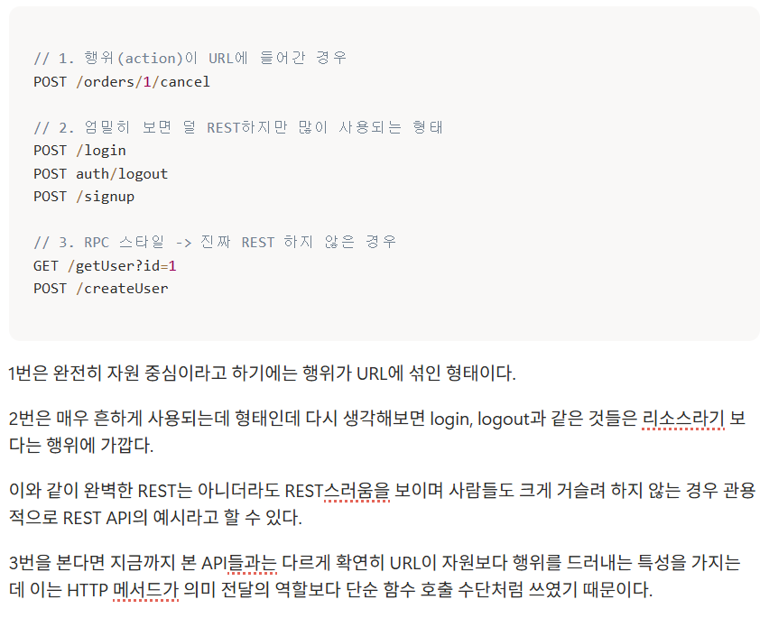

### 워크북 캡쳐

### 워크북 리뷰

<aside>
🌟

REST 하지 않은 API 와 비교적 REST 스럽게 설계된 API를 함께 예시를 들어 설명해서, URL은 자원 중심, 행위는 HTTP 메서드로 표현하는게 바람직하다는 기준을 명확히 알 수 있었다. 또, 실무에서는 완벽한 REST보다 사용성과 관용을 고려한 설계가 이루어진다는 점도 볼 수 있었다.

</aside>

# 미션
## 홈화면

- **API Endpoint**

  GET /api/users/{userId}/home

  /api/users/{userId} 도 고려했으나, 마이페이지에 더 어울리는 URL이라 생각해서  행위적 개념인 home을 추가함

- **Request Header**

  Authorization : Bearer {accessToken}

  보통 홈 화면 조회시 로그인이 되어있어야 하기 때문에 사용자 인증 정보를 전달하도록 함

- **Request Body**

  없음 → GET 메서드

- **Path Variable**

  userId

  조회하고자 하는 사용자 ID

- **Query Parameter**

  없음

  조회 대상이 Path Variable로 식별 가능해서 필요하지 않다고 판단함

## 마이페이지 리뷰 작성
- **API Endpoint**

  POST /api/stores/{storeId}/reviews

- **Request Header**

  Authorization : Bearer {accessToken}

  Content-Type: multipart/form-data

  사진(파일)과 리뷰 내용(텍스트)를 함께 전송해야 하므로 multipart/form-data 형식을 사용

- **Request Body**

| Field Name | Type | Required | Example | Description |
| --- | --- | --- | --- | --- |
| content | String | O | “맛있어요” | 리뷰 내용 |
| rating | Integer | O | 45 | 별점(4.5 → 45로 전달) |
| images | File[] | X | image1.jpg | 리뷰 사진 목록(최대 3장) |
- **Path Variable**

  storeId

  리뷰를 남길 가게의 ID

- **Query Parameter**

  없음

  리뷰 리소스를 새로 생성하는 요청이고, 추가 조건이 없어서 필요하지 않다고 판단함

## 미션 목록 조회
- **API Endpoint**

  GET /api/users/{userId}/missions

  사용자 : 미션 은 N:M 관계이고, 사용자가 더 중요한 대상이라고 판단해서 앞에 둠

- **Request Header**

  Authorization : Bearer {accessToken}

- **Request Body**

  없음 → GET 메서드

- **Path Variable**

  userId

  조회하고자 하는 사용자 ID

- **Query Parameter**

  ?status=COMPLETED&status=IN_PROGRESS

  진행중, 진행 완료 미션을 조회하기 위해 미션의 상태 조건을 Query Parameter로 전달

## 미션 성공 누르기
- **API Endpoint**

  PATCH /api/users/{userId}/missions/{missionId}

- **Request Header**

  Authorization : Bearer {accessToken}

  Content-Type: application/json

  미션의 상태를 바꾸는 요청, 변경하려는 상태값을 Body에 담아서 전달, 데이터 형식은 JSON으로 설계함

- **Request Body**

  {
  “status” :  “COMPLETED”
  }

- **Path Variable**

  userId, missionId

  상태를 변경할 사용자 미션을 사용자 ID와 미션 ID를 조합해서 식별

- **Query Parameter**

  없음

  대상이 Path Variable로 식별 가능

## 회원가입
- **API Endpoint**

  POST /auth/users

- **Request Header**

  Content-Type: application/json

  새로 사용자를 생성하는 요청, 사용자 인증 정보가 없는 상태에서의 요청이므로 Authorization 헤더를 제외함

  사용자가 가져야 할 데이터를 Body에 담아 전송, 데이터 형식은 JSON으로 설계함

- **Request Body**

  {
  “name” = “홍길동”,
  “gender” = “MALE”,
  “birth” = “2000-01-01”,
  “address” = “서울시 행복구 사랑동”
  }

- **Path Variable**

  없음

  회원 가입 이후 식별값이 생기므로 없음

- **Query Parameter**

  없음

  추가 조회 조건이 필요하지 않음