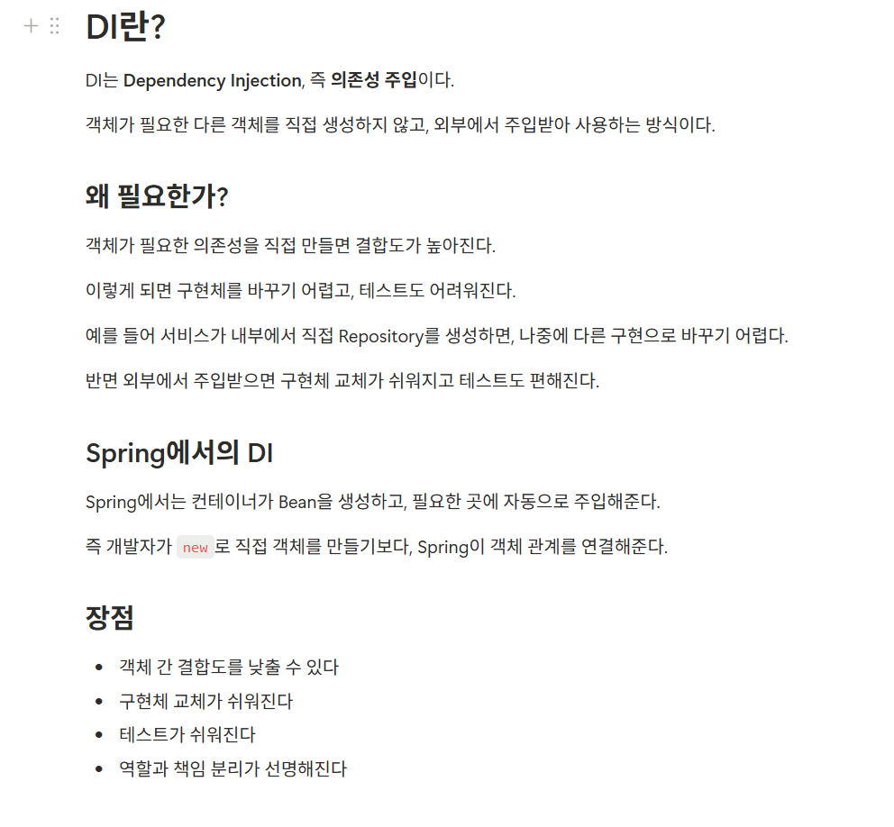
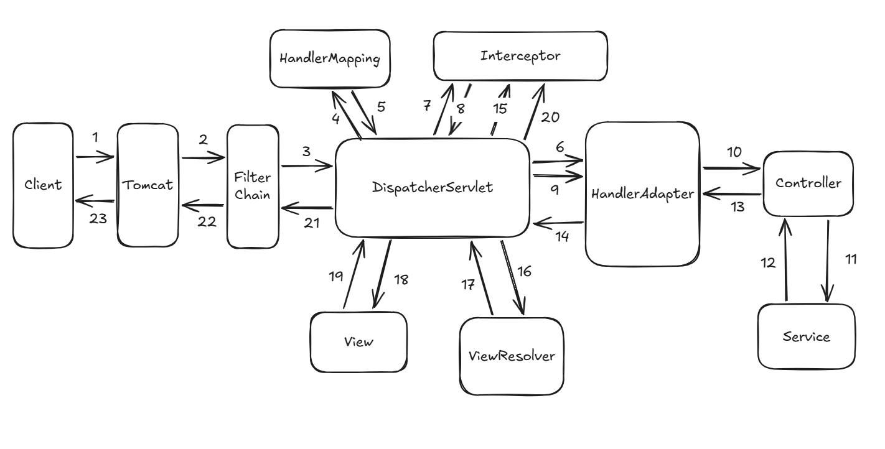
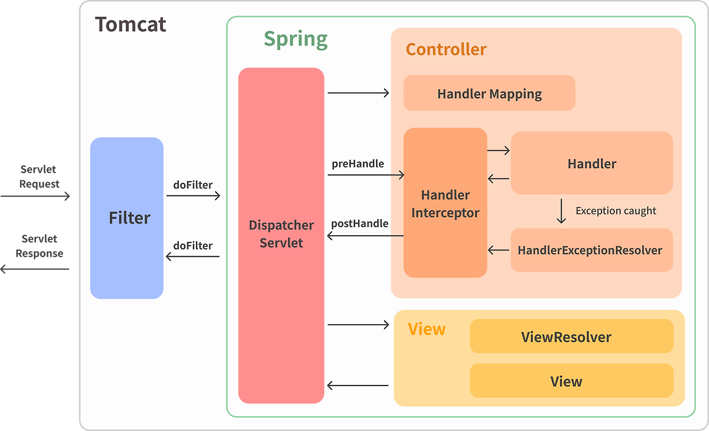

### 워크북 캡쳐

### 워크북 리뷰

<aside>
🌟

각 키워드에 대해서 정의, 필요성, Spring에서의 적용, 특징에 대해서 깔끔하게 정리해서 한 눈에 알아볼 수 있었다. 특히 필요성 부분을 보면서, 각 키워드 개념의 등장 배경까지 생각해볼 수 있었다.

</aside>

<aside>
🍀 미션 기록의 경우, 아래 미션 기록 토글 속에 작성하시거나, 페이지를 새로 생성하여 해당 페이지에 기록하여도 좋습니다!

하지만, 결과물만 올리는 것이 아닌, **중간 과정 모두 기록하셔야 한다는 점!** 잊지 말아주세요.

</aside>

- **미션 기록**

  

    1. 클라이언트의 HTTP 요청
    2. 톰캣이 요청을 받아 HttpServletRequest, HttpServletResponse 객체 생성, FilterChain을 실행

       FilterChain : 필터들의 실행 흐름, 마지막에 DispatchServlet 호출
       역할 : 전처리(응답이 들어올 때), 차단(조건에 맞지 않을 때), 후처리(응답이 나갈 때)

    3. DispatcherServlet 진입

       DispatcherServlet : Spring MVC의 Front Controller, 모든 HTTP 요청을 받아 적절한 Controller로 전달, 전체 흐름 관리

    4. HandlerMapping을 통해 Handler 조회
    5. HandlerExecutionChain 반환 (Handler + Interceptors)
    6. HandlerAdapter 조회
    7. preHandle()

       실행 전 요청 검사, 계속 진행할지 여부를 결정하는 메드

    8. boolean 반환(true면 진행, false면 종료)
    9. Handler 실행 요청
    10. Handler(controller) 호출
    11. Service 호출(business logic)
    12. 처리 결과 반환
    13. 컨트롤러 실행 결과(Model + viewname) 반환(Controller가 HandlerAdapter에게)

        Model : View에 전달할 데이터 묶음, key-value 형태

        viewname : view를 식별하기 위한 논리적 이름(문자열)

    14. 컨트롤러 실행 결과 반환(HandlerAdapter가 DispatcherServlet에게)
    15. postHandle()

        컨트롤러 실행 후, ViewResolver 호출 전에 Model과 viewname을 수정할 수 있는 메서드
        ex : 공통 데이터 추가, 로그/모니터링, View강제 변경 등이 가능

    16. ViewResolver 호출
    17. View 반환
    18. Model 전달 + view render()
    19. View가 HttpServletResponse에 렌더링 결과 작성
    20. afterCompletion()

        요청처리가 다 끝난 후 자원 정리나 로그 처리 등의 역할

    21. DispatcherServlet 처리 종료, FilterChain으로 복귀(후처리)
    22. FilterChain 종료, Tomcat으로 복귀
    23. 클라이언트에게 HTTP 응답 반환

  +추가 : Spring의 구조 이해를 위한 그림

  